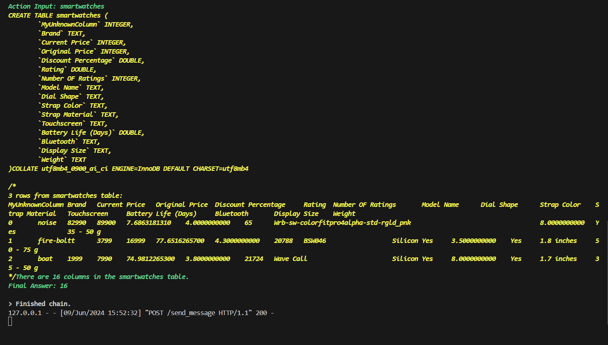

# SQL-Chat-Agent

## Description
SQL-Chat_Agent is a Python project that enables users to interact with an SQL database using natural language queries. By leveraging OpenAI's language model, the project translates user questions into SQL queries and retrieves the corresponding data from the database.

## Table of Contents
- [Installation](#installation)
- [Usage](#usage)
- [Features](#features)
- [Snippet](#Snippet)

## Installation
To set up the project, follow these steps:

1. Clone the repository:
    ```bash
    git clone https://github.com/yourusername/SQL-Chat-Agent.git
    cd SQL-Chat-Agent
    ```

2. Create and activate a virtual environment (optional but recommended):
    ```bash
    python -m venv venv
    source venv/bin/activate  # On Windows use `venv\Scripts\activate`
    ```

3. Install the required packages:
    ```bash
    pip install -r requirements.txt
    ```

4. Set up environment variables:
    - Create a `.env` file in the project root directory.
    - Add your OpenAI API key to the `.env` file:
        ```plaintext
        OPENAI_API_KEY=your_openai_api_key
        ```

## Usage
To use SQL-Chat_Agent, create an instance of the `SQL-Chat-Agent` class with your database credentials and call the `message` method with your query.

```python
from yourmodule import ChatWithSql

# Replace with your actual database credentials
chat_sql = ChatWithSql(db_user='root', db_password='yourpassword', db_host='localhost', db_name='yourdatabase')
response = chat_sql.message('How many columns are there in the table?')
print(response)
```

## Features
- Interact with an SQL database using natural language.
- Supports MySQL databases.
- Leverages OpenAI's GPT-3.5 model for natural language processing.
- Error handling for SQL parsing errors.

## Snippet of Result
- The snippet of the Home page, query input and query response is in `screenshots` folder.


